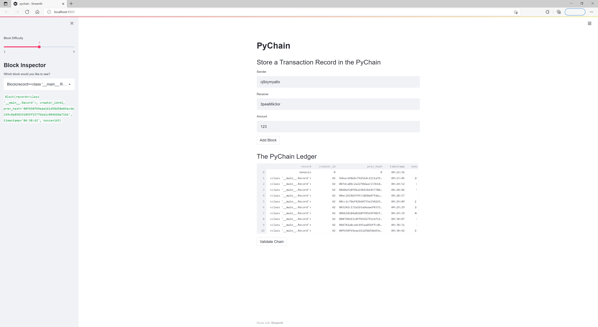
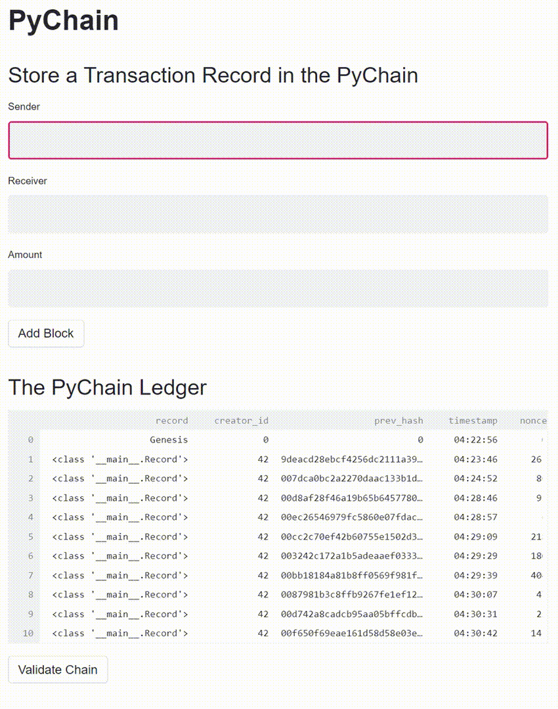
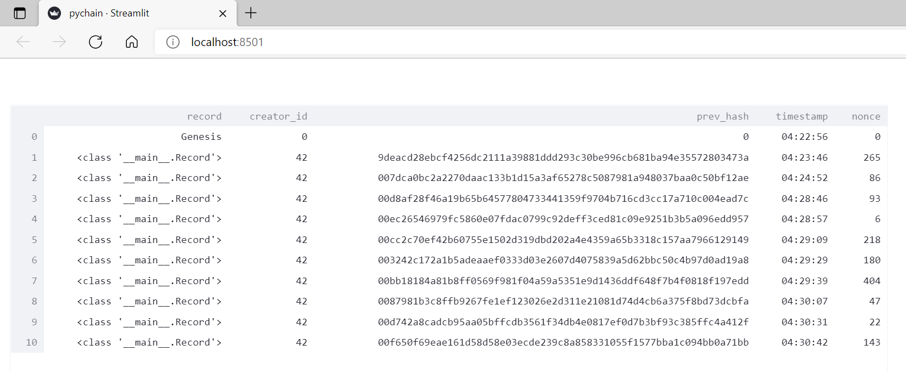

# Python-Blockchain

A Python based approach, using a ledger structure to house data classes for data block recording, hashing, validating, and chaining.

Coding begins with creating our data class Record, to house values for the sender (string), receiver (string), and amount (float) per transaction / exchange.

Following data class is our Block, containing reference to the previous data class Record, creator_id (int), prev_hash, timestamp (.utcnow), and nonce. A sub function for the hashing of blocks is created, using 256-bit encryption and applying to record, creator_id, timestamp, prev_hash, and nonce.

Next data class is our PyChain, containing sub functions for the proof_of_work, add_block, and is_valid (a validation process making reference to the previous block within the chain).

We then move onto to coding for Streamlit, allowing our code to be seen / interacted with via web browser.

We allow for inputting of user generated data with the fields of sender, receiver, amount with the phrase st.text_input.

This information is fed into our Add Block function, hashing the previous block in the chain, recording the input information, adding the new block into the chain, and concluding with a celebration of balloons to serve as confirmation of the action.

Adding onto our Streamlit code, we create a data frame (sourced from pychain.chain), add a difficulty slider (for experimentation with datamine timing), and inspection of previous blocks with the chain.

---

## Installation Guide

Before running the analysis, the following package must be installed:

*    pip install streamlit

---

## Contributors

Santiago Rosas
